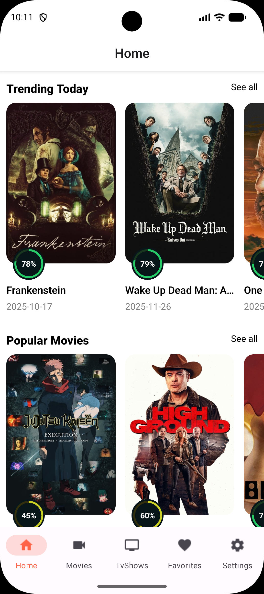
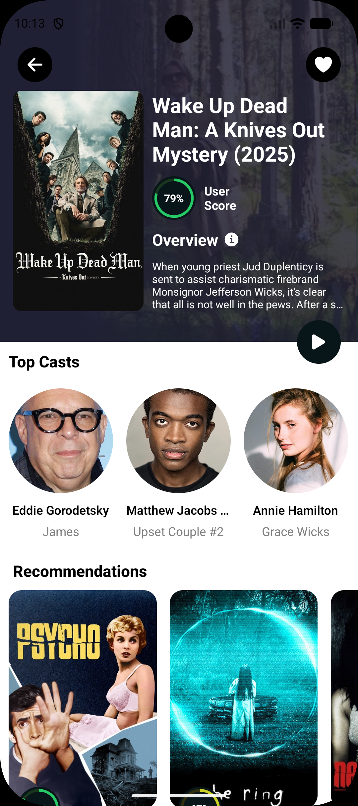
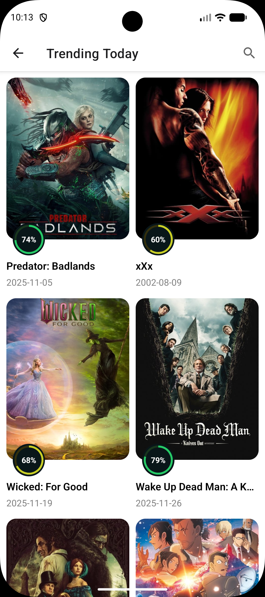
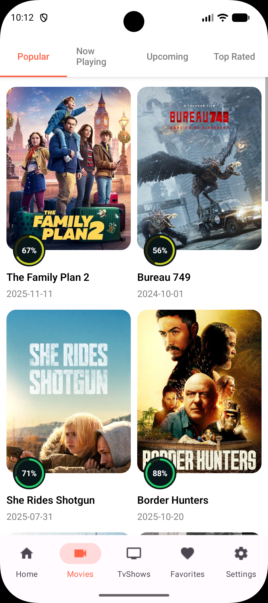
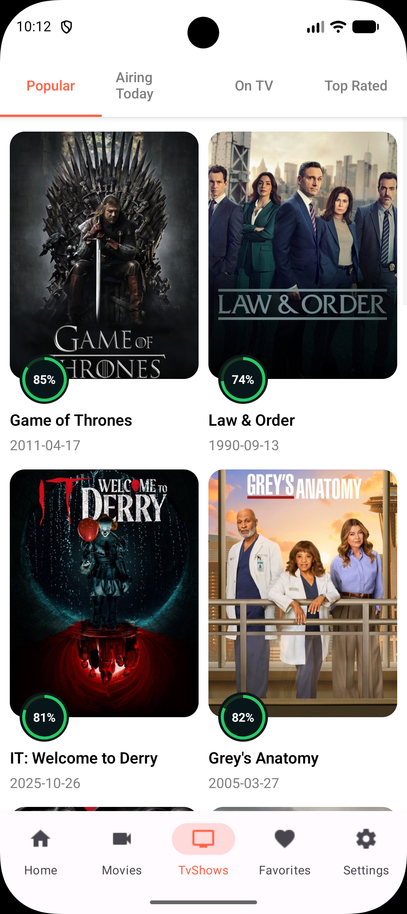
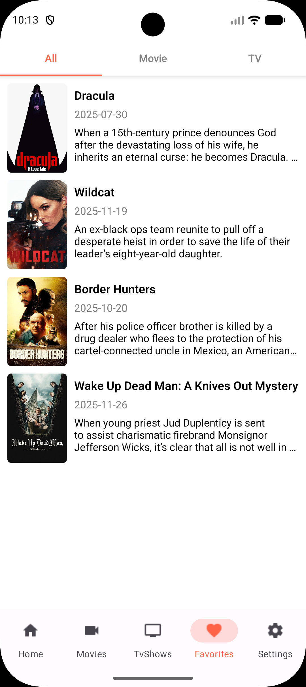
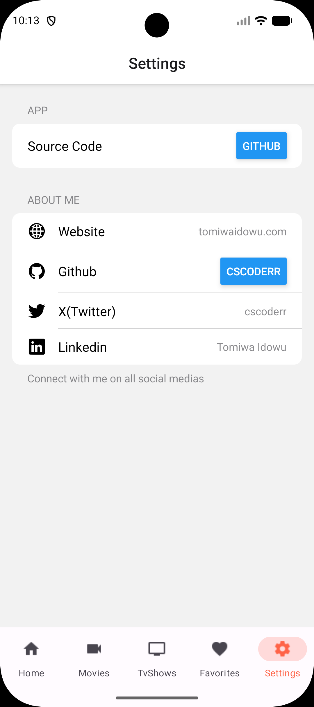

# Movie App

## Overview
The Movie app is a React Native-powered cross-platform application for Android and iOS, utilizing Zustand for state management and React Query for efficient data fetching and caching. It retrieves a wide selection of movies from the MovieDB API, ensuring real-time updates and a smooth user experience. Additionally, AsyncStorage is integrated to allow users to save and manage their favorite movies persistently, providing a seamless and personalized experience.

### Screenshots

## IOS

<h4 align="center">
 

 

## Android

<h4 align="center">
 

 

